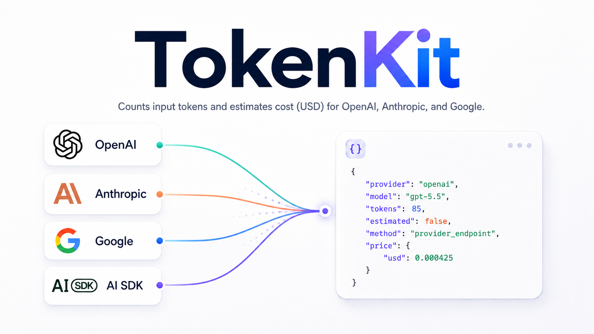

<p align="center">
  
</p>

Count tokens **before sending a request** or **before persisting a provider response** to your database. tokens-usage supports OpenAI, Anthropic, and Google so you can track context window usage with accurate counts, plan what fits in the next turn, and avoid unexpected API costs.

tokens-usage also supports AI SDK message formats (`ModelMessage` / `UIMessage`) as input. AI SDK is not a provider.

Uses the provider's official endpoint when available (`mode: "endpoint"` or `"auto"` with an API key). Otherwise, it uses local strategies (`mode: "local"`).

## Install

```bash
npm install tokens-usage
```

If you pass `UIMessage[]` as `content`, install AI SDK as well:

```bash
npm install tokens-usage ai
```

## Usage

```ts
import { countTokens, estimateTokens } from "tokens-usage";

const result = await countTokens({
  provider: "openai",
  model: "gpt-5.5",
  content: [
    { role: "user", content: "Hello" },
    {
      type: "function_call",
      call_id: "call_1",
      name: "get_weather",
      arguments: "{\"city\":\"Paris\"}",
    },
  ],
  apiKey: process.env.OPENAI_API_KEY,
  countAssistantTools: true,
});

console.log(result.tokens);
console.log(result.estimated);
console.log(result.method);
console.log(result.price);
```

Plain text is the simplest form:

```ts
await countTokens({
  provider: "openai",
  model: "gpt-4o",
  content: "Hello world",
});
```

### AI SDK (`ModelMessage` / `UIMessage`)

```ts
import { countTokens, type ModelMessage, type UIMessage } from "tokens-usage";

const modelMessages: ModelMessage[] = [
  { role: "system", content: "Be concise." },
  { role: "user", content: [{ type: "text", text: "Hello" }] },
];

await countTokens({
  provider: "openai",
  model: "gpt-4o",
  content: modelMessages,
});

const uiMessages: UIMessage[] = [
  {
    id: "1",
    role: "user",
    parts: [{ type: "text", text: "Hi from UIMessage" }],
  },
];

await countTokens({
  provider: "google",
  model: "gemini-2.0-flash",
  content: uiMessages,
});
```

Notes:
- `ModelMessage[]` uses strict model validation per provider:
  - model must exist in tokens-usage catalog
  - model must be supported by AI SDK for that provider
- `UIMessage[]` is converted internally with AI SDK `convertToModelMessages` (requires the `ai` peer dependency).
- v1 counts text + tool parts; non-text media parts are ignored.

## Provider Inputs

### OpenAI

```ts
await countTokens({
  provider: "openai",
  model: "gpt-5.5",
  content: "Hello world",
});

await countTokens({
  provider: "openai",
  model: "gpt-5.5",
  content: [{ role: "user", content: "Hello world" }], // ResponseInput
});
```

### Anthropic

```ts
await countTokens({
  provider: "anthropic",
  model: "claude-sonnet-4-6",
  content: "Hello",
  system: "Be concise",
});

await countTokens({
  provider: "anthropic",
  model: "claude-sonnet-4-6",
  content: [{ role: "user", content: [{ type: "text", text: "Hello" }] }],
  system: "Be concise",
});
```

### Google (Gemini)

```ts
await countTokens({
  provider: "google",
  model: "gemini-3.5-flash",
  content: "Hello",
  system: "Be concise",
});

await countTokens({
  provider: "google",
  model: "gemini-3.5-flash",
  content: [{ role: "user", parts: [{ text: "Hello" }] }],
});
```

## `content` (auto-detected)

Pass `content` as a string or array. tokens-usage infers the format automatically:

| Shape | Detected as |
|---|---|
| `string` | Plain text |
| OpenAI `ResponseInput` (incl. `function_call` items) | OpenAI native |
| Anthropic `MessageParam[]` | Anthropic native |
| Google `Content[]` (`parts`) | Google native |
| AI SDK `ModelMessage[]` (`content`, tool parts, `tool` role) | AI SDK messages |
| AI SDK `UIMessage[]` (`parts` with typed items) | UI messages |

Optional top-level fields:
- `system?: string` — for plain text (Anthropic/Google) or Anthropic native payloads
- `systemInstruction?: Content` — for Google native payloads

Validation is fail-fast:
- Plain text must be non-empty.
- Arrays must include at least one item.
- AI SDK messages require strict model support (catalog + AI SDK).
- Non-text media parts are ignored for counting in AI SDK / UI paths (v1).

## Migration 0.3 → 0.4

In 0.4.0, `inputMode` was removed. Pass the payload directly as `content`:

| 0.3.x | 0.4.0 |
|---|---|
| `{ inputMode: "text", input: "Hi" }` | `{ content: "Hi" }` |
| `{ input: responseInput }` (OpenAI) | `{ content: responseInput }` |
| `{ messages: [...] }` (Anthropic) | `{ content: [...] }` |
| `{ contents: [...] }` (Google) | `{ content: [...] }` |
| `{ inputMode: "ai_sdk", aiSdkMessages }` | `{ content: modelMessages }` |
| `{ inputMode: "ai_sdk", uiMessages }` | `{ content: uiMessages }` |
| `{ system: "..." }` (Anthropic text) | `{ content: "...", system: "..." }` |

No `content.type` field is required — the library infers it from the shape.

`estimateTokens` uses the same shape (without `mode`).

## `countAssistantTools`

Default: `true`.

When set to `false`, tool blocks are excluded from the count:
- OpenAI: `function_call`, `function_call_output`
- Anthropic: `tool_use`, `tool_result`
- Google: `functionCall`, `functionResponse`

## Modes

- `auto` (default): tries the endpoint and falls back to local if a recoverable error occurs
- `endpoint`: uses only the provider endpoint
- `local`: no network

`estimateTokens(options)` is equivalent to `countTokens({ ...options, mode: "local" })`.

## API Keys

Can be passed via `apiKey` or environment variables:

| Provider | Env var |
|----------|---------|
| OpenAI | `OPENAI_API_KEY` |
| Anthropic | `ANTHROPIC_API_KEY` |
| Google | `GOOGLE_GENERATIVE_AI_API_KEY` or `GEMINI_API_KEY` or `GOOGLE_API_KEY` |

## Response Shape

```ts
{
  provider: "openai" | "anthropic" | "google",
  model: string,
  tokens: number,
  estimated: boolean,
  method: "provider_endpoint" | "local_tiktoken" | "local_anthropic" | "local_heuristic",
  price: { usd: number } | null
}
```

## Local Strategies

- OpenAI: `tiktoken`
- Anthropic: `@anthropic-ai/tokenizer`
- Google: chars/4 heuristic

Also exports `countHeuristic({ text })`.

## Scripts

```bash
npm test
npm run test:integration
npm run try:all
npm run try:openai
```

## Notes

- Counts input tokens (prompt/input), not output tokens.
- `price` is `null` if the model is not in the pricing table.

## License

tokens-usage is source-available under a custom license. See [LICENSE.md](./LICENSE.md) for the full terms.
